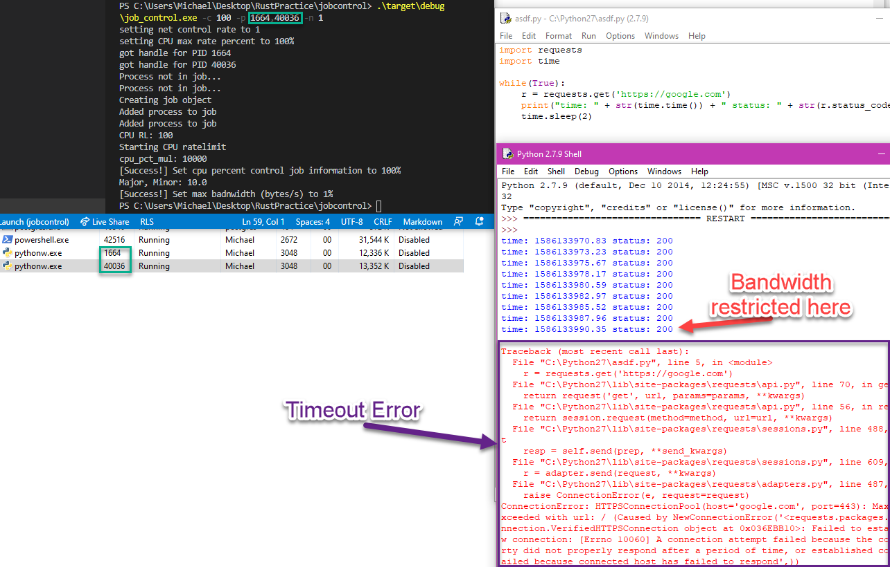

## Slowing Processes

### When AV/EDR needs to take chill out

The Windows API exposes a few constructs for restricting a process' or processes' resource usage from usermode. Windows [Jobs[1]](https://docs.microsoft.com/en-us/windows/win32/procthread/job-objects) are logical containers of processes responsible for resource management (CPU Time, RAM, Network Bandwidth, Window Handles, etc.). Windows jobs adhere to a [nested hierarchy[2]](https://docs.microsoft.com/en-us/windows/win32/procthread/nested-jobs), meaning one job may contain one or more other jobs, each with their own set of processes assigned to them, and their own respective resource restrictions.

To use this functionality, a handle to one or more processes must be obtained with the following permissions:

```
PROCESS_TERMINATE | PROCESS_SET_QUOTA 
```
To note, this will require the same privilege level as the process, as well as the `PROCESS_TERMINATE` permission, which may be prevented from obtaining depending on the process' protection, though most commonly if the assigner has the same privilege as the *asignee*, the `PROCESS_TERMINATE` flag will be allowed when obtaining a handle to the process. Further, the processes of interest must not be already assigned to a job, or a new job must be created as a sub-job within that process' containing job [3][4].

(Jobception, eh?)

Some situations may arise where killing an AV/EDR process might cause an alert, or otherwise expose an attackers intentions. Wouldn't it be nice if there existed a capability to keep the process alive but otherwise non-functioning?

Suppose another situation where a lame-duck (cough cough looking at you, cylance) might *not detect a sample or behavior* but still upload a sample or otherwise communicate with a SIEM/Log aggregation service actively monitored by a blue team. Wouldn't it be nice if one could tell the process, "Hey, how about you only get to send *One Byte* of traffic per second?"

Well aren't we lucky!

Processes assigned to a job can available resources altered through the winapi function [`SetInformationJobObject`[5]](https://docs.microsoft.com/en-us/windows/win32/api/jobapi2/nf-jobapi2-setinformationjobobject). Most importantly, CPU rate (from 100% - *__0.01%__*), as well as network bandwidth.

Once a handle to a process is gained, and a handle to new job for us to use is created (via `CreateJobObjectW` and `CreateObjectA` [[6]](https://docs.microsoft.com/en-us/windows/win32/api/winbase/nf-winbase-createjobobjecta)), we can assign those processes to a job with [`AssignProcessToJobObject` [7]](https://docs.microsoft.com/en-us/windows/win32/api/jobapi2/nf-jobapi2-assignprocesstojobobject).

Once each process we care about is assigned to a job, we will alter the corresponding job's information objects [[1]](https://docs.microsoft.com/en-us/windows/win32/procthread/job-objects) with `SetJobInformationObject`

**NOTE: Once CPU and network resources are set for a job, the only way to revert them is through a restart**, though the handle to the job can be safely closed from the *assigner* with no change to our set values.

This package serves to highlight two functionalities:

1. Set CPU usage percentage
2. Set network max bandwidth in bytes per second

```
Usage: job_control.exe -p/-pids 1,2,3,4 -c 0.01 -n

Options:
    -p, --pids 4,1013,139213,400
                        PID list to interact with
    -c, --cpu 0.01      max CPU usage for all processes (must be between 100.0
                        and 0.01)
    -n, --netrate 50    attempt to set the bytes per second of network traffic
                        for all processes ( >= W10, Server 2016 ONLY )
    -h, --help          display help and usage
```

Not much more to add, except some pictures!

We'll use some basic python to show the network restricting functionality:
```python
import requests
import time

# Every two seconds, print the current time and the HTTP status code of a get request to google
while(True):
    r = requests.get('https://google.com')
    print("time: " + str(time.time()) + " status: " + str(r.status_code))
    time.sleep(2)
```
The following picture shows the job controller restricting the network traffic to the point that the python script actually just times out!



The following GIF shows the job controller restricting the CPU usage percent, basically rendering the target process useless.


### Building - Windows

Ensure rust is installed on your system and you have `git clone`'d and `cd`'ed into the repo and:

```
cargo build --release
```

And that's it :)

[1]https://docs.microsoft.com/en-us/windows/win32/procthread/job-objects

[2]https://docs.microsoft.com/en-us/windows/win32/procthread/nested-jobs

[3]https://docs.microsoft.com/en-us/windows/win32/procthread/nested-jobs#creating-a-nested-job-hierarchy

[4]https://docs.microsoft.com/en-us/windows/win32/procthread/nested-jobs#nested-job-hierarchies

[5]https://docs.microsoft.com/en-us/windows/win32/api/jobapi2/nf-jobapi2-setinformationjobobject

[6]https://docs.microsoft.com/en-us/windows/win32/api/winbase/nf-winbase-createjobobjecta

[7]https://docs.microsoft.com/en-us/windows/win32/api/jobapi2/nf-jobapi2-assignprocesstojobobject